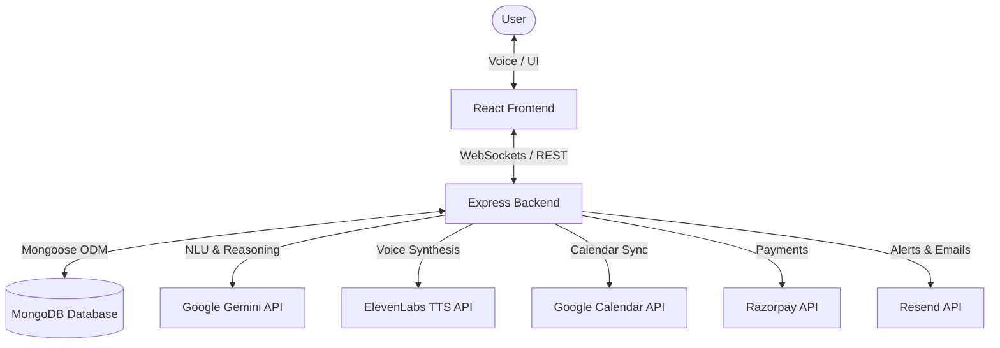
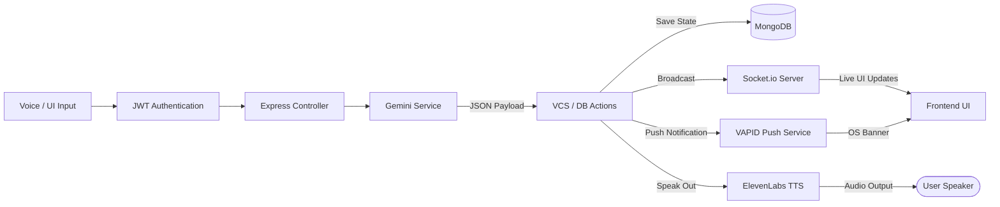
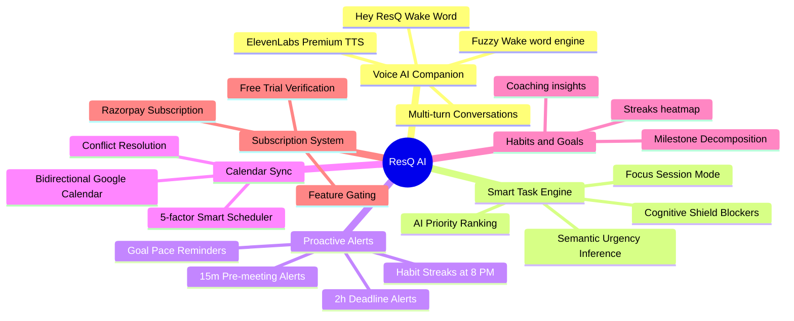
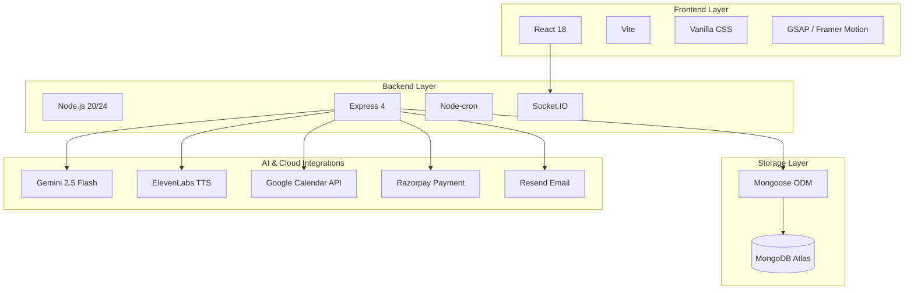
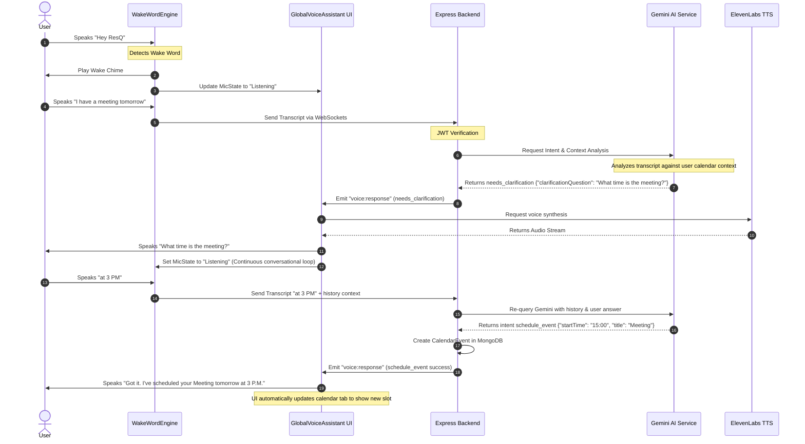
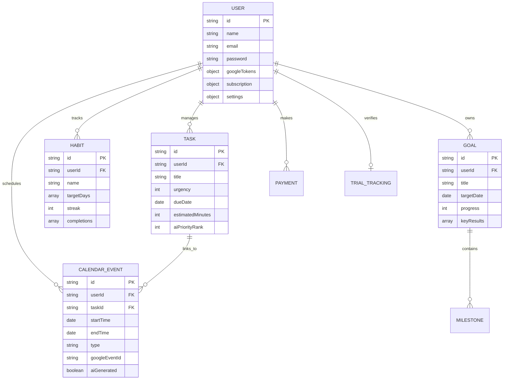

# ResQ — AI Productivity Companion

> **Your AI doesn't just remind you. It acts before you miss.**

<div align="center">
  
  
  
  
  
</div>

---

## 📌 Problem Statement

> *"Build an AI-powered productivity companion that proactively assists users in planning, prioritizing, and completing tasks before deadlines are missed. The solution should move beyond traditional reminders and focus on helping users take meaningful action."*

### Why Traditional Apps Fail:
- **Passive Repositories:** Traditional to-do apps store tasks like graveyard files, expecting users to manually check and execute them. They never help you *execute* the work.
- **Snoozed Alerts:** Push notifications act as static alerts. Because they are easily dismissed, users ignore them and return to the same disorganized routines.
- **Disconnected Context:** Calendar apps show what's scheduled, not what actually matters *right now* based on current deadlines, goals, and habits.
- **Fragmented Workspaces:** There is no unified system connecting the dots between your tasks, calendar events, habits, and long-term goals in real-time.

---

## 💡 Our Solution

**ResQ** is a full-stack, proactive AI productivity companion powered by **Google Gemini** that runs a continuous intelligence loop. Instead of waiting for you to open the app, **ResQ comes to you**. It runs automated background scanners and coordinates real-time synchronization to ensure you stay ahead of your schedule.

```
Every 5 minutes → Cron scans all users:
  ├── Tasks due within 2 hours      → Urgent alert (WebPush + Email + Voice)
  ├── Meetings starting in 15 min   → Pre-meeting context alert
  ├── Habits unfinished at 8 PM     → Consistency streak push reminder
  ├── Goals < 20% near deadline     → Milestone velocity alert
  └── Morning login after 6 AM      → Gemini-generated spoken daily briefing
```

ResQ acts as an **agentic partner** rather than a passive notebook. It leverages Gemini to interpret spoken language, ask clarification questions when instructions are vague, auto-resolve calendar conflicts, and dynamically manage focus blocks.

---

## 🎨 System Diagrams

### A. System Architecture Diagram
The MVC architecture splits responsibilities cleanly between the frontend user interface, the Express backend routing layer, local scheduled services, and third-party AI APIs.



### B. End-to-End Data Flow
This diagram details the sequence of data transit, starting from user speech input, parsing through NLU nodes, and triggering notifications, voice feedback, and database mutations.



### C. Feature Map
A comprehensive mindmap grouping ResQ's key feature offerings by operational domain.



### D. Tech Stack Architecture
The vertical structure of technologies, showing how frameworks map from the customer viewport down to serverless hosting and third-party service instances.



### E. Sequence Diagram (Continuous Conversation Loop)
This details the multi-turn conversational loop, illustrating how ResQ maintains state and asks clarifying questions during ambiguous requests.



### F. Entity Relationship Diagram
Our MongoDB schema design showing standard data relationships, foreign key bindings, and indexes.



---

## 🛠️ How It Works (Internal Mechanics)

### 1. The 10 Gemini AI Prompts & Pipelines
ResQ operates 10 distinct, customized prompt instructions through `@google/generative-ai` to ensure contextual relevance:

| Pipeline | Model Call | Input Parameters | Output Format (JSON Mode) | Purpose |
| :--- | :--- | :--- | :--- | :--- |
| `generateDailySummary` | `gemini-2.5-flash` | User profile, tasks, habits, calendar, and goals | `{ "briefingText": string }` | Generates a conversational morning briefing. |
| `generateTaskPriority` | `gemini-2.5-flash` | List of active user tasks | `[{ "id": string, "rank": number, "reason": string }]` | Ranks and comments on daily priorities. |
| `generateAutoSchedule` | `gemini-2.5-flash` | Tasks, Calendar Events, Sleep/Wake hours | `[{ "taskId": string, "start": date, "end": date }]` | Creates focus blocks without overlaps. |
| `generateHabitInsight` | `gemini-2.5-flash` | Individual habit log and 30-day streak statistics | `{ "insight": string, "coachingTip": string }` | Analyzes performance patterns. |
| `generateGoalBreakdown` | `gemini-2.5-flash` | Goal description, target dates | `[{ "milestone": string, "week": number, "hours": number }]` | Decomposes goals into milestones. |
| `cleanManualMilestones` | `gemini-2.5-flash` | Text block inputs of user milestones | `[{ "milestone": string, "week": number, "effort": number }]` | Cleans unstructured text to valid JSON schemas. |
| `handleVoiceCommand` | `gemini-2.5-flash` | Audio transcript, active tab, timezone, histories | `{ "intent": string, "actionPayload": object }` | Core conversational natural language unit. |
| `generateNotification` | `gemini-2.5-flash` | Target alert context (e.g. deadline risk) | `{ "title": string, "message": string }` | Drafts personalized and compelling alerts. |
| `generateGlobalPriority`| `gemini-2.5-flash` | Combined array of all four modules | `[{ "item": string, "urgency": number, "reason": string }]` | Ranks top 4 high-priority items globally. |
| `inferTaskUrgency` | `gemini-2.5-flash` | Task name, due date, estimated effort | `{ "urgencyScore": number }` | Automatically calculates urgency 1–10. |

### 2. Smart Auto-Scheduler Slot Algorithm
When scheduling focus blocks automatically, ResQ evaluates available slots using a weighted scoring model:
$$\text{Score} = (W_w \cdot \text{WorkHours}) + (W_b \cdot \text{BufferDistance}) + (W_p \cdot \text{PeakProductivity}) - (W_c \cdot \text{ConflictPenalty})$$
- **Work Hours:** Ensures events fall within user-configured working hours.
- **Buffer Distance:** Calculates proximity to existing meetings to prevent back-to-back fatigue.
- **Peak Productivity:** Uses user bio-profile preference (Morning vs Night person) to rank optimal hours.
- **Conflict Penalty:** Subtracts score if it overlaps with Google Calendar events.

### 3. Voice Companion & Conversation Loop
The wake word engine runs continuously in the browser using the Web Speech API.
1. **Fuzzy Recognition:** The engine listens for audio. When words matching "ResQ" or "Rescue" are recognized, it plays a chime.
2. **Context Preservation:** If user input is incomplete, the backend stores the pending command in a TTL cache.
3. **Safety Release Locks:** Added safety timeout boundaries (12s in wake-word detection, 15s in fallback speech-synthesis) to guarantee the microphone is never locked in a perpetual state due to browser engine freezes.

---

## ✨ Core Features

- **🗣️ Agentic Voice Companion** — Use hands-free voice commands via `"Hey ResQ"`. Gemini parses intent and executes direct database actions (create task, schedule event, complete habit, change theme, start focus session) using `@google/generative-ai`.
- **🔄 Multi-Turn Clarification Loops** — Intelligent, human-like interviewer loops. If a request is vague (e.g., *"Create a presentation"*), ResQ asks follow-up questions to gather details (destination, dates, type) and retains context across multiple turns.
- **⚡ Cross-Domain Priority Engine** — A single, consolidated Gemini prompt ranks the top 4 urgent actions across all domains (tasks, calendar, habits, goals) simultaneously.
- **📅 Bidirectional Google Calendar Sync** — Syncs calendar events via OAuth2 and `googleapis`. Includes real-time conflict resolution and a 5-factor scoring scheduler to auto-fill focus time blocks.
- **🛡️ Focus Session & Cognitive Shield** — Deep work overlay that mutes browser notifications, blocks distractions, and enforces time limits.
- **📈 Proactive Cron Alerts** — Monitors workload every 5 minutes to trigger push notifications, emails, and spoken alerts for upcoming deadlines (2 hours prior), meetings (15 mins prior), and incomplete habits (at 8 PM).
- **💳 Payment & Trial Gating** — Secure credit trial tracking (email + phone unique indicators to prevent abuse) and subscription plans verified via Razorpay HMAC signature.

---

## 🛠️ Tech Stack & Inventory

| Layer | Technology | Purpose | Version |
| :--- | :--- | :--- | :--- |
| **Frontend** | React | Component-based UI library | `^19.2.6` |
| **Frontend** | Vite | Rapid bundler & development server | `^8.0.12` |
| **Frontend** | GSAP / Framer Motion | Smooth dashboard transitions & micro-animations | `^3.15.0` / `^12.42.0` |
| **Backend** | Node.js / Express | Server platform and REST routing API | `20+` / `^4.19.2` |
| **Backend** | Socket.IO | Bi-directional websocket connection for alerts | `^4.7.5` |
| **Backend** | Node-cron | Scheduled database scanners (5-minute interval) | `^4.5.0` |
| **Database** | MongoDB / Mongoose | Database hosting & object modeling | `Atlas` / `^8.4.1` |
| **AI Integration**| Google Gemini | Core NLU, prioritization, and scheduling logic | `gemini-2.5-flash` |
| **Voice / Sync** | Web Speech API | Client-side Speech-To-Text (STT) parsing | *Native* |
| **Voice / Sync** | ElevenLabs API | High-fidelity Text-To-Speech (TTS) engine | *REST API* |
| **Integrations** | Google Calendar API | Calendar event synchronizations (OAuth2) | `v3` / `^173.0.0` |
| **Payments** | Razorpay SDK | Order processing & signature checks | `^2.9.6` |
| **Mailing** | Resend / Nodemailer | Automated transactional email triggers | `^6.14.0` / `^9.0.1` |

---

## 📁 Project Structure

```
├── backend/
│   ├── config/              # Database, Gemini, and Google API configurations
│   ├── controllers/         # Express API controllers (Auth, Tasks, Voice, Payments)
│   ├── middleware/          # Authentication guards, error handlers, and billing checks
│   ├── models/              # Mongoose DB Schemas (User, Task, Event, Habit, goal)
│   ├── routes/              # Express endpoint routers
│   ├── services/            # Core business logic (Gemini, Google Cal, Cron scheduler)
│   ├── socket/              # WebSockets management and room bindings
│   ├── server.js            # Node app entry point
│   └── package.json         # Backend dependencies & dev scripts
├── frontend/
│   ├── src/
│   │   ├── components/      # UI parts (Dashboard widgets, Landing sections)
│   │   ├── config/          # Client environment variables
│   │   ├── pages/           # Landing, Sign-in, and Dashboard parent layouts
│   │   ├── services/        # Client socket, API, Wake Word, and Voice engines
│   │   ├── index.css        # Main glassmorphic styling sheet
│   │   └── main.jsx         # React application entry point
│   ├── package.json         # Frontend dependencies & configurations
│   └── vite.config.js       # Vite bundle configuration
├── Dockerfile               # Production multi-stage Docker build pipeline
└── README.md                # Project documentation
```

---

## ⚡ Quick Start

### Prerequisites
- Node.js `20.x` or `24.x`
- MongoDB database (local or MongoDB Atlas)
- Google Cloud Console credentials (OAuth 2.0 client)
- Gemini API Key

### Installation

1. **Clone the repository:**
   ```bash
   git clone https://github.com/its5zoo/ResQ.git
   cd ResQ
   ```

2. **Configure Backend Environment Variables:**
   Create a `.env` file in the `backend/` directory:
   ```env
   PORT=5000
   MONGO_URI=mongodb+srv://<username>:<password>@cluster.mongodb.net/resq
   JWT_SECRET=your_jwt_signature_secret_string
   GEMINI_API_KEY=your_gemini_api_credentials
   GEMINI_MODEL=gemini-2.5-flash
   GOOGLE_CLIENT_ID=your_gcp_oauth_client_id
   GOOGLE_CLIENT_SECRET=your_gcp_oauth_client_secret
   GOOGLE_REDIRECT_URI=http://localhost:5000/api/google/callback
   ELEVENLABS_API_KEY=your_eleven_labs_voice_api_key
   VAPID_PUBLIC_KEY=vapid_key_for_push_notifications
   VAPID_PRIVATE_KEY=vapid_private_key_for_push_notifications
   VAPID_EMAIL=mailto:support@yourdomain.com
   RAZORPAY_KEY_ID=rzp_test_your_razorpay_key
   RAZORPAY_KEY_SECRET=your_razorpay_secret_key
   CLIENT_URL=http://localhost:5173
   ```

3. **Configure Frontend Environment Variables:**
   Create a `.env` file in the `frontend/` directory:
   ```env
   VITE_API_URL=http://localhost:5000/api
   VITE_SOCKET_URL=http://localhost:5000
   VITE_RAZORPAY_KEY_ID=rzp_test_your_razorpay_key
   ```

4. **Install dependencies:**
   ```bash
   # Install Backend dependencies
   cd backend && npm install
   
   # Install Frontend dependencies
   cd ../frontend && npm install
   ```

5. **Generate VAPID Keys (for WebPush):**
   ```bash
   cd ../backend
   npx web-push generate-vapid-keys
   ```

6. **Run the Application:**
   ```bash
   # In terminal 1 (Backend):
   cd backend
   npm run dev
   
   # In terminal 2 (Frontend):
   cd frontend
   npm run dev
   ```
   Open `http://localhost:5173` to access the application.

---

## 🔌 API Reference

### Auth & Settings
| Method | Endpoint | Description | Headers |
| :--- | :--- | :--- | :--- |
| **POST** | `/api/auth/register` | Register new user account | None |
| **POST** | `/api/auth/login` | Login to retrieve JWT token | None |
| **GET** | `/api/auth/me` | Fetch active user credentials | `Authorization: Bearer <Token>` |
| **GET** | `/api/google/login-url` | Generate Google Calendar OAuth URL | `Authorization: Bearer <Token>` |
| **GET** | `/api/google/callback` | OAuth2 callback redirect handler | None |

### Voice AI Companion
| Method | Endpoint | Description | Headers |
| :--- | :--- | :--- | :--- |
| **POST** | `/api/voice/command` | Dispatch voice command to Gemini | `Authorization: Bearer <Token>` |
| **GET** | `/api/voice/usage` | Fetch monthly quota statistics | `Authorization: Bearer <Token>` |
| **POST** | `/api/voice/tts` | Synthesize ElevenLabs voice audio | `Authorization: Bearer <Token>` |

### Tasks & Scheduler
| Method | Endpoint | Description | Headers |
| :--- | :--- | :--- | :--- |
| **GET / POST** | `/api/tasks` | Fetch or create user tasks | `Authorization: Bearer <Token>` |
| **POST** | `/api/tasks/prioritize` | Trigger Gemini task priority sorting | `Authorization: Bearer <Token>` |
| **POST** | `/api/tasks/auto-schedule`| Auto-schedule focus slots on calendar | `Authorization: Bearer <Token>` |

---

## 🚢 Deployment

The application is deployed using a multi-stage `Dockerfile` targeting serverless environments like **Google Cloud Run**.

1. **Build the production Docker image locally:**
   ```bash
   docker build -t resq-app:latest .
   ```
2. **Deploy to Google Cloud Run:**
   ```bash
   gcloud run deploy resq-service \
     --image=gcr.io/your-project-id/resq-app:latest \
     --platform=managed \
     --region=us-central1 \
     --allow-unauthenticated
   ```

---

## 🤝 Contributing

Contributions are welcome! Please follow these guidelines:
1. Fork the repository and create a new feature branch.
2. Ensure your changes compile locally (`npm run build`).
3. Run the linter (`npm run lint`) to avoid code styling regressions.
4. Submit a Pull Request describing your changes and testing logs.

---

## 📄 License

MIT — Built with ❤️ for the Google AI Hackathon 2025

*ResQ — Because missing deadlines is not an option.*
